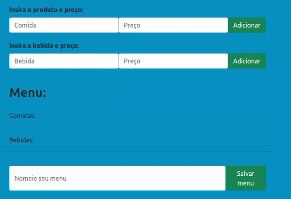
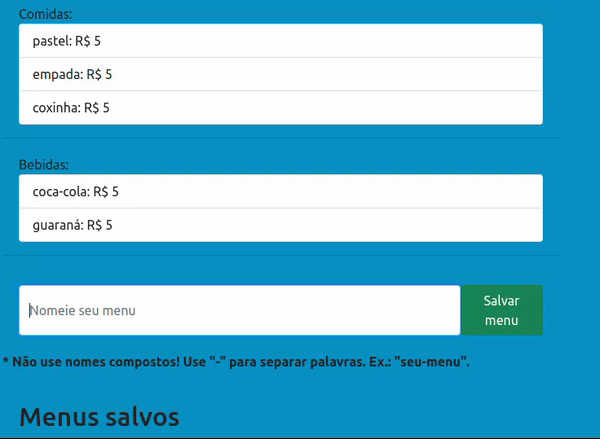
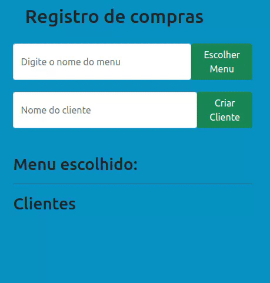

# MEU MENU

##### Projeto desenvolvido por Gabriel Asaf. 
### Software gerenciador de menus e vendas de Restaurantes. Desenvolvido pura e exclusivamente com HTML, CSS e JavaScript.

# ÍNDICE

<!--ts-->
   * [Organização do Repositório](#organização-do-repositório)
   * [Modo de uso](#modo-de-uso)
   * [Instalação](#instalacao)
<!--te-->

# ORGANIZAÇÃO DO REPOSITÓRIO: 

<!--ts-->
  * [HTML]
  * [CSS]
  * [JavaScript]
<!--te-->

# Modo de uso

Para adicionar um alimento ou uma bebida, prossiga para os campos responsáveis a esquerda da tela, digite seu nome, registre o preço e clique no botão "Adicionar". Ao adicioná-lo, o produto será exibido na tela.

Uma vez que adicionou as comidas e bebidas, digite o nome do menu (Não digite nomes compostos). Uma vez nomeado, aperte no botão "Salvar menu" e o veja ser listado logo abaixo. Todos os menus são salvos no local-storage do seu navegador.

Para usufruir de um dos menus salvos, pesquise pelo nome do seu menu e clique no botão "Escolher menu". Logo em seguida a lista de comidas e bebidas vendidas será exibida. 

Para poder cadastrar um cliente, digite seu nome e aperte o botão "Criar cliente". Uma seção nova será criada para este cliente, onde você poderá registrar os produtos consumidos e ver o preço total a ser pago. Uma vez que o cliente consumiu o todo, sua "comanda" poderá ser encerrada.

# INSTALAÇÃO: 

Ao clonar o projeto, você deverá usar a extensão Live Server (ou outra semelhante) para acessar o aplicativo.

____________________________________________________________________________

Project developed by Gabriel Asaf.

